# Azure Data Factory Pipeline — Superstore Dataset

## Objective
Build an end-to-end data pipeline using Azure Data Factory (ADF) to copy 
data from a source location to a destination in Azure Blob Storage, using 
IAM/RBAC for access control — built from zero prior cloud knowledge.

## Tools Used
- Azure Data Factory (ADF)
- Azure Blob Storage
- Azure IAM (Role-Based Access Control)

## Steps Performed

1. **Resource Group** — Created a resource group to organise all Azure 
   resources for this project.
   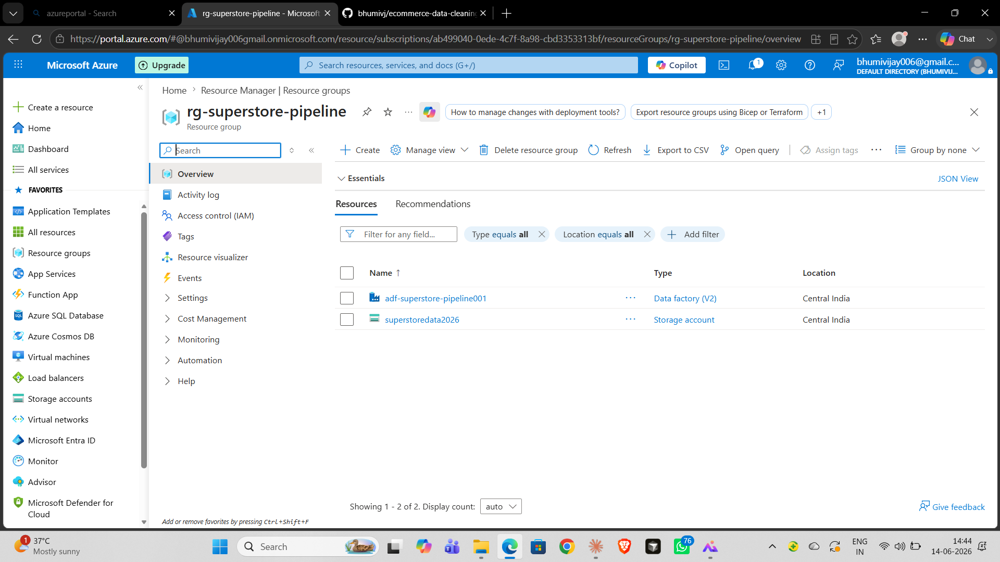

2. **Storage Container & Data Upload** — Created a Blob storage container 
   and uploaded the Superstore dataset.
   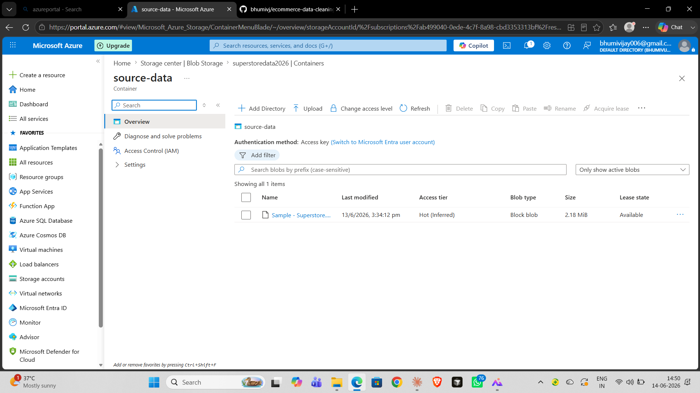

3. **ADF Studio Overview** — Opened Azure Data Factory Studio to begin 
   building the pipeline.
   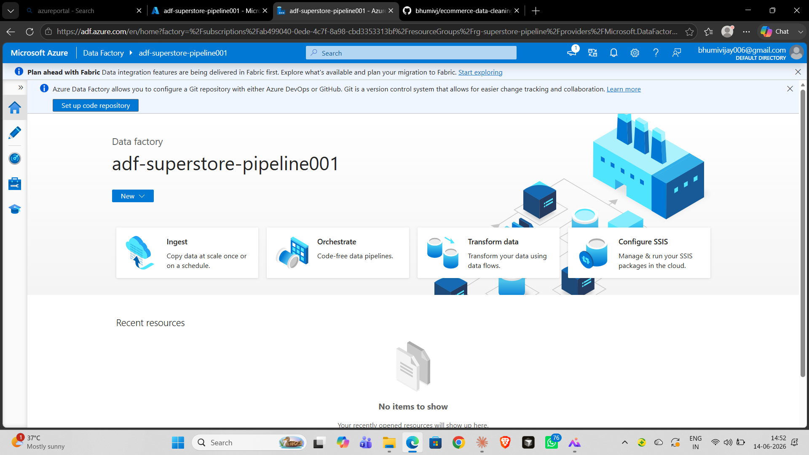

4. **Linked Service** — Configured a linked service connecting ADF to the 
   Blob Storage account.
   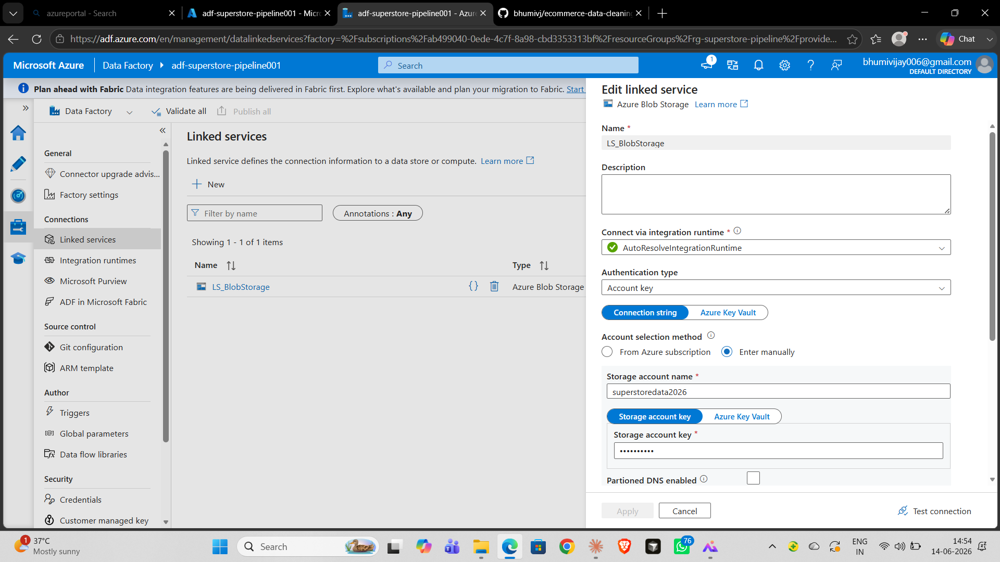

5. **Source Dataset** — Created a dataset pointing to the source file in 
   Blob Storage.
   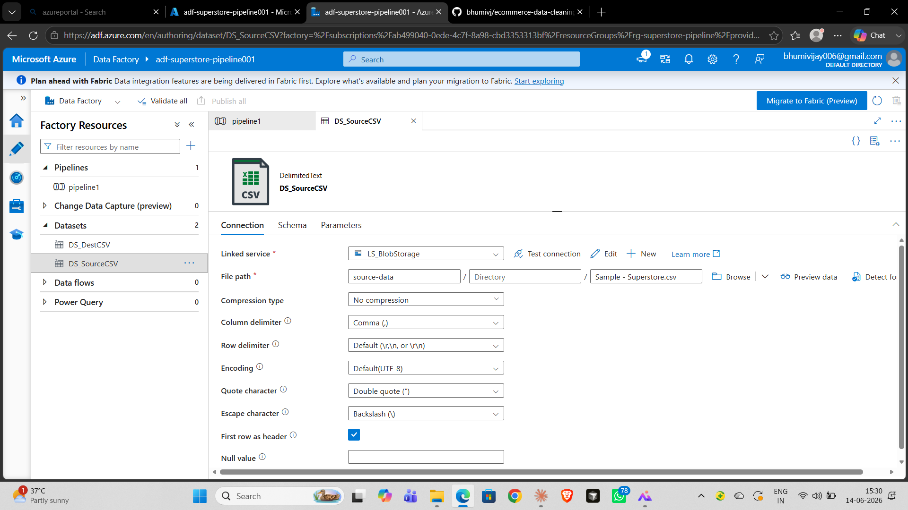

6. **Destination Dataset** — Created a dataset pointing to the destination 
   location in Blob Storage.
   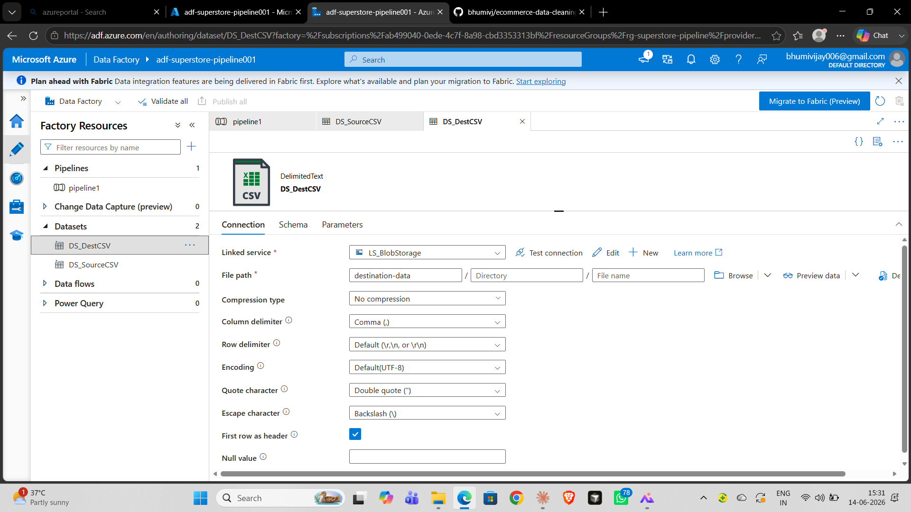

7. **Get Metadata Activity** — Added a Get Metadata activity to read source 
   file properties before copying.
   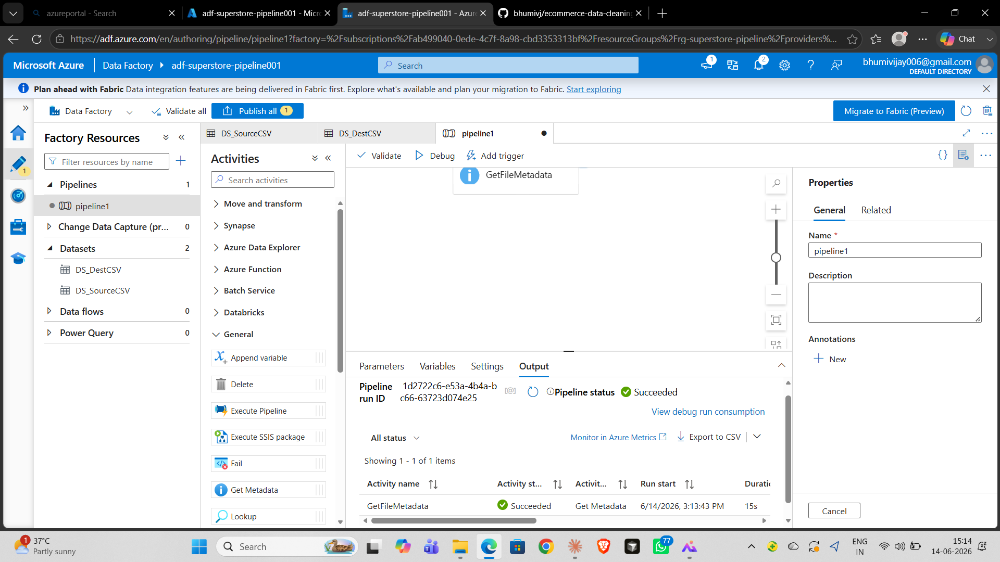

8. **Pipeline Design** — Combined Get Metadata and Copy activities into a 
   single pipeline.
   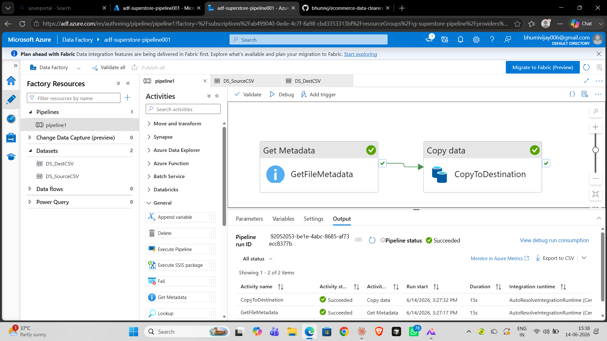

9. **Pipeline Run — Success** — Triggered the pipeline and confirmed 
   successful execution.
   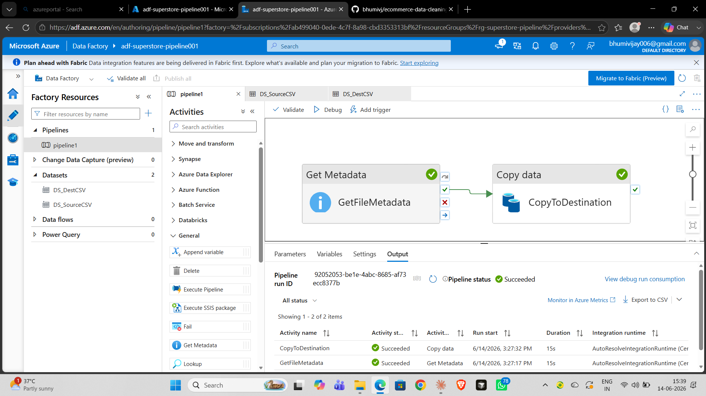

10. **Destination File Copied** — Verified the file was copied to the 
    destination container.
    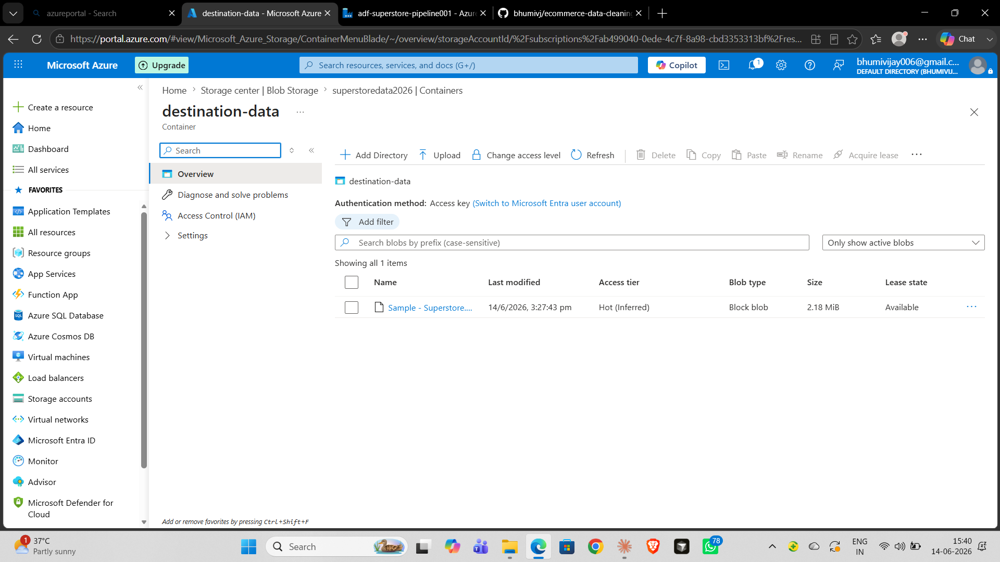

11. **IAM Roles (RBAC)** — Configured IAM roles to manage access permissions 
    for the storage account.
    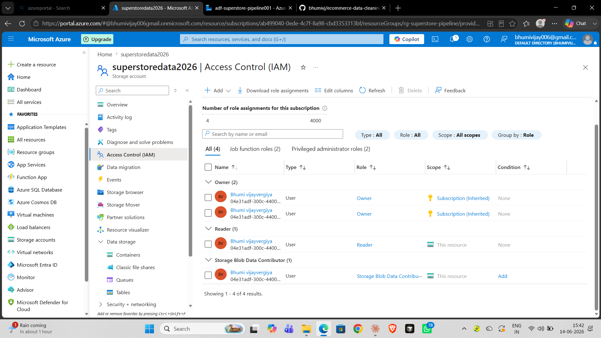

## Summary
- Resource group, storage account, and container set up successfully
- ADF pipeline built with linked services, source/destination datasets, 
  Get Metadata and Copy activities
- Pipeline executed successfully; file copied to destination container
- IAM/RBAC roles configured for secure access management
